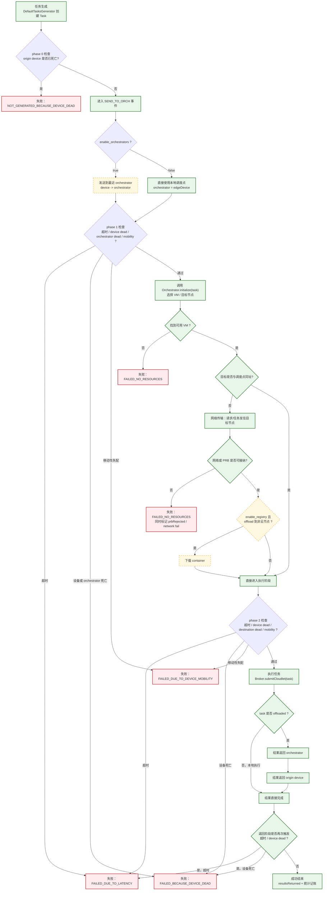

# MAPPO 组会 PPT 结构稿

适用场景：`15-18` 分钟组会汇报  
主线：`PureEdgeSim + MAPPO` 工程实现  
交付形式：逐页 PPT 结构稿 + 两张 Mermaid 图 + 两张核心定义表 + 参考来源

## 使用建议
- 主内容按 `14` 页设计，最后附 `1` 页参考来源。
- 理论部分控制在 `25%` 左右，重点放在“状态怎么定义、动作怎么落地、task 怎么流转、为什么会失败”。
- 每页尽量只保留 `1` 个核心图或 `1` 张核心表，不要在同一页堆太多代码截图。

## 逐页 PPT 结构稿

### 第 1 页 标题页（0.5 min）
**页标题**

MAPPO 在边缘任务卸载中的应用

**副标题**

基于 PureEdgeSim 的多智能体协同调度实现与任务生命周期分析

**核心要点**
- 研究对象是边缘计算中的任务卸载与资源调度。
- 当前工作不是纯理论 MAPPO，而是已经落到 `PureEdgeSim` 仿真环境中的工程实现。
- 报告重点包括：状态定义、动作定义、奖励设计、训练实现、task 完整工作流。

**建议图示/表格**
- 背景图可用“终端设备 - 边缘节点 - 云”的三层架构示意。

**讲述提示**
- 开场先说明本次汇报既讲 MAPPO，也讲它在当前仿真平台中的具体落地。
- 给听众一个预期：后面会把“算法”和“仿真事件流”两条线合起来讲。

### 第 2 页 研究背景与问题定义（1.5 min）
**页标题**

为什么任务卸载适合建模为多智能体协同决策

**核心要点**
- 边缘任务卸载不是单一节点的局部优化，而是多个候选节点之间的协同资源分配。
- 决策目标通常同时涉及 `时延`、`成功率`、`能耗`、`网络拥塞`，天然是多目标约束问题。
- 单智能体 PPO 更适合“一个 agent 选一个动作”的场景，但当前实现中存在多个候选执行节点和共享网络资源。
- MAPPO 更适合 cooperative scheduling：各 agent 共享策略表示，但训练时使用全局状态做 centralized critic。

**建议图示/表格**
- 一张问题定义图：多个终端任务竞争 `4 个 edge DC + 1 个 cloud` 的计算与无线资源。

**讲述提示**
- 这里不要先讲公式，先讲“为什么不是简单 rule-based”。
- 强调难点来自两类耦合：`计算资源耦合` 和 `网络 PRB 耦合`。

### 第 3 页 当前工程场景说明（1.5 min）
**页标题**

当前 MAPPO 实验场景不是通用设置，而是固定 5-agent 配置

**核心要点**
- 当前 `MAPPOManager` 强制要求 `4 个 EDGE_DATACENTER + 1 个 CLOUD`，总计 `5 agents`。
- 当前训练配置来自 `settings_mappo_5agents_train`，卸载架构为 `EDGE_AND_CLOUD`。
- 当前训练配置中 `enable_orchestrators=false`，意味着每个终端设备默认“自己作为调度点”。
- 当前训练配置中 `enable_registry=false`，因此完整仿真支持的 `container download` 分支在训练主路径中默认关闭。
- 其他环境参数可简要带出：`simulation_time=10 min`、`50` 个 edge devices、`speed=1.4 m/s`、`realistic_network_model=true`。

**建议图示/表格**
- 一张小表格：`agent 数量 / 候选目标 / 是否启用 orchestrator / 是否启用 registry / 网络模型`。

**讲述提示**
- 这一页的作用是“先把边界讲清楚”，避免后面把“PureEdgeSim 全量能力”和“当前 MAPPO 实验配置”混在一起。
- 特别强调：`5-agent` 指的是调度候选节点，不是 `50` 个终端设备。

### 第 4 页 MAPPO 核心思想（1.5 min）
**页标题**

MAPPO：Centralized Training, Decentralized Execution

**核心要点**
- 训练时使用全局状态 `global state` 估计价值函数，这是 centralized critic。
- 执行时只需要当前观测与动作 mask 采样动作，这是 decentralized execution。
- 当前工程里 actor 是共享参数的 `SharedActor`，critic 是 `CentralCritic`。
- 共享 actor 的好处是：减少参数量、增强不同 agent 间的泛化能力。
- 中心 critic 的好处是：在训练阶段能看到全局负载、云边负载差异、PRB 占用等信息。

**建议图示/表格**
- 左右结构图：左侧 `actor(共享)`，右侧 `critic(全局)`，下方注明 `CTDE`。

**讲述提示**
- 只需要给出 CTDE 的概念，不必推完整 PPO 目标函数。
- 把理论直接连到后面：为什么 current implementation 既有 `5 x 14` 的 local obs，又有 `76` 维 global state。

### 第 5 页 当前仓库中的 MAPPO 总体实现（2 min）
**页标题**

MAPPO 在 PureEdgeSim 中如何落地

**核心要点**
- Java 侧由 `SimulationManager -> CustomEdgeOrchestrator -> MAPPOManager` 驱动调度。
- `MAPPOManager` 在每个 task 调度点构造 `obs/state/action_mask`，通过 `MAPPOEnvServer` 发给 Python 侧。
- Python 侧由 `MAPPOClient + SharedActor + CentralCritic` 接收状态、采样动作、缓存 transition、周期性更新参数。
- task 完成后，Java 侧再异步回传 `reward / next_obs / next_state`，因此这是“仿真驱动、延迟奖励”的交互方式。
- actor 网络包含 `agent id embedding`，priority head 依赖“被选中的目标 hidden + pooled hidden”。

**建议图示/表格**
- 插入下面的“图 1：MAPPO 在 PureEdgeSim 中的系统结构图”。

**讲述提示**
- 明确两条时间线：`调度时` 先出动作，`任务结束时` 才回 reward。
- 这一页最好让听众建立“Java 是环境，Python 是 learner”的整体认知。

### 第 6 页 状态定义（2 min）
**页标题**

状态定义：5 x 14 的 local observation + 76 维 global state

**核心要点**
- 每个候选 agent 都有一份 `14` 维局部观测，表示“当前 task 对这个候选节点来说是否值得选”。
- local obs 同时编码了 `任务特征`、`节点负载`、`网络可行性`、`距离`、`当前仿真时刻`。
- global state 先把 `5 x 14` 的局部观测展平，再补充 `6` 个全局统计量。
- 全局统计量的作用是让 critic 感知系统级拥塞，而不仅是单个候选节点的局部情况。

**建议图示/表格**
- 页内只放精简版状态表。
- 完整可复制版本见下文“表 1：状态定义表”。

**讲述提示**
- 这一页不要只念维度，要讲“为什么要把 deadline ratio、distance、network admissible 放进状态里”。
- 推荐把 `local obs` 理解成“同一个 task 看 5 个候选节点的 5 份画像”。

### 第 7 页 动作定义（1.5 min）
**页标题**

动作定义：目标节点选择 + 优先级桶选择

**核心要点**
- 当前动作不是单头，而是双头输出。
- 第一头 `dest_action` 选择卸载目标，动作空间大小为 `5`，对应 `4 个 edge DC + 1 个 cloud`。
- 第二头 `priority_action` 选择优先级桶，动作空间大小也为 `5`，再映射到实际 `priority bin = {0, 2, 5, 8, 10}`。
- `action_mask` 用于屏蔽不可选目标，例如网络不可接纳、候选 VM 不存在、位置不可达。
- 若模型给出无效目标，环境会执行 fallback：退化为“当前可行动作中预计完成时间最短的候选”。

**建议图示/表格**
- 动作空间示意图：`dest_head` 和 `priority_head` 两个输出分支。
- 完整定义见下文“表 2：动作与奖励定义表”。

**讲述提示**
- 重点解释 `priority_action` 的含义不是“直接分配多少 PRB”，而是“影响网络分配时的权重”。
- 可以顺带提一句：这就是为什么动作设计兼顾了“算力目标”和“网络优先级”两个维度。

### 第 8 页 奖励与约束（1.5 min）
**页标题**

奖励函数与候选筛选约束

**核心要点**
- 当前奖励函数为：`r = 2*success - 2*failed - delayNorm - 0.3*prbReject - 0.1*energyNorm`。
- 其中 `delayNorm` 来自 `总完成时间 / 最大容忍时延`，`energyNorm` 来自滑动窗口 `P95` 归一化。
- `prbReject` 用于惩罚网络无法接纳的 task。
- 候选 VM 的筛选先看 `offloadingIsPossible`，再看 `canAdmitDynamicTransfer(task, vm)`。
- 所以 MAPPO 不是在任意节点上自由选，而是在“架构、位置、网络都可行”的候选集合中选。

**建议图示/表格**
- 奖励项条形图：正向项 `success`，负向项 `failed / delay / prbReject / energy`。

**讲述提示**
- 强调 reward 不是只优化成功率，而是把 `时延 + 网络 + 能耗` 都纳入了。
- 这一页可以顺手回答“为什么 action mask 还不够，环境还要做 fallback”。

### 第 9 页 网络与优先级机制（1.5 min）
**页标题**

priority_action 如何影响无线资源分配

**核心要点**
- task 的 `priority_action` 最终会写入 `lanPriorityBin`。
- `DefaultNetworkModel` 对共享同一 LAN 的活跃传输先构造冲突组件，再做动态 PRB 分配。
- 所有动态传输先获得最小保底 PRB，再把剩余 PRB 按 `1 + priorityBin` 的权重做加权分配。
- 若一个冲突组件的可用 PRB 连“每个动态传输至少 1 个块”都不满足，则相关 task 会被判为网络失败。
- 因此 priority 机制的本质是“竞争场景下的加权带宽分配”，而不是单任务独占。

**建议图示/表格**
- 一张示意图：多个 task 共享同一 LAN，PRB 按优先级权重分配。

**讲述提示**
- 这页非常关键，因为它回答了“为什么 MAPPO 要学第二个动作头”。
- 讲清楚 `priority bin` 不是 QoS 标签，而是会进入 PRB 分配逻辑的实际控制量。

### 第 10 页 训练流程（2 min）
**页标题**

训练流程：异步环境交互 + 周期性 PPO 更新

**核心要点**
- 每当 Java 环境发来一个 `marl_obs`，Python 侧就用 actor 采样一组 `dest_action + priority_action`。
- Python 端用 `pending[step_id]` 暂存该次决策的 `obs/state/action/log_prob/value/mask`。
- 当任务结束后收到 `marl_transition`，再把 reward 和 done 补全写入 `EpisodeBuffer`。
- `EpisodeBuffer` 汇总多个 episode 后，用 `GAE` 计算 `advantage/return`。
- 默认每 `4` 个 episode 做一次 `PPO clipped objective` 更新；测试脚本里使用 `deterministic=True` 做贪心推理。

**建议图示/表格**
- 一张时序图：`obs -> action -> task finish -> transition -> buffer -> update`。

**讲述提示**
- 推荐强调“异步”这个词：观测在调度时产生，reward 在任务完成时产生。
- 如果有人问为什么不用标准同步 step 环境，这页可以直接回答。

### 第 11 页 task 完整生命周期工作流图（2 min）
**页标题**

task 从创建到成功/失败卸载的完整工作流

**核心要点**
- task 生命周期不是“创建后直接执行”，而是经历 `生成 -> 调度 -> 传输 -> 可选拉容器 -> 执行 -> 结果返回 -> 记账`。
- 完整 PureEdgeSim 支持 orchestrator 分支、container 分支、网络失败分支、mobility 分支、设备死亡分支。
- 当前 MAPPO 训练配置只走其中一条主路径，但完整答辩时必须能解释所有可能情况。

**建议图示/表格**
- 插入下面的“图 2：task 完整生命周期工作流图”。

**讲述提示**
- 讲图时先从主成功路径走一遍，再按 `phase 0 / phase 1 / phase 2` 插入失败点。
- 这一页建议你多花时间，因为它最能体现你对仿真环境的理解。

### 第 12 页 完整仿真流程 vs 当前 MAPPO 主路径（1.5 min）
**页标题**

为什么完整流程比当前 MAPPO 训练主路径更长

**核心要点**
- 完整 PureEdgeSim 可以启用 `orchestrator`，即 task 先发到最近 orchestrator，再由 orchestrator 决定目标节点。
- 完整 PureEdgeSim 也可以启用 `registry`，使 offloaded task 先下载 container 再执行。
- 当前 MAPPO 训练配置中 `enable_orchestrators=false`，所以默认 `task.orchestrator = edgeDevice`。
- 当前 MAPPO 训练配置中 `enable_registry=false`，所以容器下载分支在训练主路径中被跳过。
- 因此当前训练的主路径更接近“终端本地调度点直接决定是否发往 edge DC / cloud”。

**建议图示/表格**
- 一张双列表：左列“完整 PureEdgeSim”，右列“当前 MAPPO 配置”。

**讲述提示**
- 这一页是答辩防守页，专门防止别人问“你图里 container download 为什么训练里没出现”。
- 结论要明确：完整流程要会讲，当前实验路径也要会分开讲。

### 第 13 页 可展示指标（1.5 min）
**页标题**

组会中最值得展示的指标与图表

**核心要点**
- `MAPPO reward`：横轴时间/step，纵轴 reward，作用是展示策略学习趋势。
- `tasks success rate`：横轴时间，纵轴成功率，作用是展示系统级效果。
- `tasks failure breakdown`：横轴时间，纵轴失败任务数，重点看 `latency / mobility / resource / network` 分类。
- `allocated PRB blocks / network pressure`：横轴时间，纵轴 PRB blocks，作用是解释网络瓶颈是否成为主要约束。
- 若时间允许，可加 `destination distribution` 和 `priority distribution` 做行为可解释性分析。

**建议图示/表格**
- 本页不要放真实图，建议放一个“图名 - 横轴 - 纵轴 - 解读口径”四列表。
- 可引用的现成导出图名包括：`mappo_reward`、`tasks_success_rate`、`tasks_failed`、`allocated_prb_blocks`。

**讲述提示**
- 这一页的重点不是报数，而是说明“这些图为什么能证明策略有效或无效”。
- 讲解口径推荐从“性能结果”过渡到“行为解释”。

### 第 14 页 总结（1 min）
**页标题**

总结：MAPPO 学到了什么，task 流程里卡在哪里

**核心要点**
- 当前实现把 task 卸载建模为“目标节点选择 + 网络优先级选择”的双头动作问题。
- 状态定义覆盖了任务属性、节点算力、空间位置和网络可行性，因此策略能综合做云边协同调度。
- task 失败不只有“算力不够”，还包括 `deadline`、`mobility`、`device dead`、`network/PRB` 等多种分支。
- 当前工程最大的亮点是：算法、仿真事件流、网络资源竞争三者已经打通。

**建议图示/表格**
- 一张三行总结卡片：`算法层`、`系统层`、`仿真层`。

**讲述提示**
- 结束时不要重复整份 PPT，而是回到三个核心问题：
- `MAPPO 为什么适合这里？`
- `状态和动作到底定义成了什么？`
- `task 为什么会成功，为什么会失败？`

### 第 15 页 参考来源（附录，可不计入主内容）
**页标题**

参考来源

**核心要点**
- 当前仓库代码实现。
- 当前 MAPPO 训练配置文件。
- MAPPO 标准论文。

**建议图示/表格**
- 无图，列出文件路径与论文名称即可。

**讲述提示**
- 若时间不够可不讲，只保留在备份页中。

## 图 1：MAPPO 在 PureEdgeSim 中的系统结构图

```mermaid
flowchart LR
    subgraph JavaSide["Java 仿真侧（环境）"]
        SM["SimulationManager<br/>任务事件调度 / 生命周期推进"]
        ORCH["CustomEdgeOrchestrator<br/>统一调度入口"]
        MM["MAPPOManager<br/>构造 obs/state/mask<br/>接收动作并写回 task"]
        ENV["MAPPOEnvServer<br/>Socket JSON 通信"]
    end

    subgraph PySide["Python 训练侧（Learner）"]
        CLIENT["MAPPOClient<br/>接收消息 / 回传动作"]
        ACTOR["SharedActor<br/>共享策略网络<br/>输出 dest_action + priority_action"]
        CRITIC["CentralCritic<br/>输入 76 维 global state"]
        BUFFER["EpisodeBuffer + GAE<br/>缓存 transition"]
        PPO["PPO Update<br/>clip objective / entropy / value loss"]
    end

    SM --> ORCH --> MM
    MM -- "marl_obs<br/>obs + state + action_mask + step_id" --> ENV
    ENV <-- "Socket JSON" --> CLIENT
    CLIENT --> ACTOR
    CLIENT --> CRITIC
    ACTOR -- "dest_action + priority_action" --> CLIENT
    CLIENT -- "marl_action" --> ENV
    ENV --> MM
    MM --> ORCH --> SM

    SM -- "task 完成 / 失败后" --> ORCH
    ORCH -- "reinforcementFeedback(task)" --> MM
    MM -- "marl_transition<br/>reward + next_obs + next_state" --> ENV
    CLIENT --> BUFFER --> PPO
    PPO --> ACTOR
    PPO --> CRITIC
```

## 图 2：task 完整生命周期工作流图

说明：
- 绿色节点表示“当前 MAPPO 训练配置的主路径中会经过的节点”。
- 黄色节点表示“完整 PureEdgeSim 支持，但当前 MAPPO 默认配置可跳过的可选分支”。
- 红色节点表示失败终点。

## 表 1：状态定义表

### 1. local observation（每个候选 agent 14 维，共 5 份）

| 维度 | 名称 | 含义 | 典型范围/处理 | 作用 |
| --- | --- | --- | --- | --- |
| 0 | `taskLengthNorm` | 当前 task 的计算长度 | 按最大 task length 归一化 | 反映计算负载 |
| 1 | `taskDeadlineNorm` | 当前 task 的时延约束 | 按最大 deadline 归一化 | 反映时延敏感度 |
| 2 | `requestSizeNorm` | 请求数据大小 | 按最大 request size 归一化 | 影响上传开销 |
| 3 | `resultSizeNorm` | 返回结果大小 | 按最大 result size 归一化 | 影响回传开销 |
| 4 | `containerSizeNorm` | 容器大小 | 按最大 container size 归一化 | 影响是否值得远端执行 |
| 5 | `cpuUtilNorm` | 目标节点 CPU 利用率 | `avgCpuUtilization / 100` | 反映当前负载 |
| 6 | `runningTasksNorm` | 目标数据中心正在运行的任务数 | 按每个数据中心最大 VM 数归一化 | 反映排队压力 |
| 7 | `totalMipsNorm` | 目标节点总 MIPS | 按全局最大总 MIPS 归一化 | 反映算力规模 |
| 8 | `finishOverDeadline` | 预计完成时间 / deadline | 截断到 `[0, 2]` | 反映是否可能超时 |
| 9 | `distanceNorm` | 源设备到目标节点距离 | 按最大覆盖距离归一化 | 反映空间可达性 |
| 10 | `networkAdmissible` | 网络是否允许当前传输 | 二值 `{0,1}` | 反映网络可行性 |
| 11 | `prbRemaining` | 当前 WLAN 剩余 PRB 比例 | `[0,1]` | 反映网络剩余容量 |
| 12 | `isCloud` | 候选节点是否为 cloud | 二值 `{0,1}` | 让 actor 区分云/边 |
| 13 | `simTimeNorm` | 当前仿真时间 | 按总仿真时长归一化 | 反映系统阶段 |

### 2. global state（76 维）

前 `70` 维：
- 将 `5` 个候选 agent 的 `14` 维 local observation 直接展平。

后 `6` 维全局统计量：

| 维度 | 名称 | 含义 | 作用 |
| --- | --- | --- | --- |
| 70 | `activeTasksNorm` | 当前系统活跃任务数 | 让 critic 感知全局拥塞 |
| 71 | `edgeCpuMeanNorm` | 所有 edge DC 的平均 CPU 利用率 | 反映边缘整体负载水平 |
| 72 | `edgeCpuStdNorm` | edge DC CPU 利用率标准差 | 反映边缘负载均衡程度 |
| 73 | `cloudCpuNorm` | cloud CPU 利用率 | 反映云侧负载 |
| 74 | `allocatedPrbRatio` | 已分配 PRB 比例 | 反映网络拥塞程度 |
| 75 | `simTimeNorm` | 当前仿真时间 | 让 critic 区分早期/晚期阶段 |

## 表 2：动作与奖励定义表

| 项目 | 定义 | 取值/公式 | 作用 |
| --- | --- | --- | --- |
| `dest_action` | 目标节点选择动作 | `0..4`，对应 `4 个 edge DC + 1 个 cloud` | 决定 task 送往哪里执行 |
| `priority_action` | 优先级桶动作 | `0..4` | 决定传输优先级的离散桶 |
| `selected_priority_bin` | 优先级桶映射结果 | `{0, 2, 5, 8, 10}` | 写入 `lanPriorityBin`，参与 PRB 分配 |
| `action_mask` | 可行动作掩码 | 每个候选一位，`1` 可选、`0` 不可选 | 屏蔽不可达、无 VM、网络不可接纳的目标 |
| `fallback destination` | 无效目标回退策略 | 在有效候选中选 `estimatedFinishTime` 最小者 | 保证环境可执行 |
| `success` | 成功指示项 | `task.status != FAILED ? 1 : 0` | 奖励正项 |
| `failed` | 失败指示项 | `task.status == FAILED ? 1 : 0` | 奖励负项 |
| `delayNorm` | 时延惩罚项 | `clamp(totalTime / maxLatency, 0, 2)` | 惩罚超慢决策 |
| `prbReject` | 网络拒绝惩罚项 | `task.isPrbRejected() ? 1 : 0` | 惩罚 PRB 不足导致的失败 |
| `energyNorm` | 能耗惩罚项 | `clamp(totalEnergy / energyP95, 0, 2)` | 惩罚高能耗决策 |
| `reward` | 总奖励 | `2*success - 2*failed - delayNorm - 0.3*prbReject - 0.1*energyNorm` | 平衡成功率、时延、网络与能耗 |

## 第 13 页可直接复制的“指标解释表”

| 图名 | 横轴 | 纵轴 | 想说明什么 |
| --- | --- | --- | --- |
| `mappo_reward` | 时间或更新步 | Reward | 策略是否稳定学习、是否出现震荡 |
| `tasks_success_rate` | 时间 | Success rate (%) | 系统整体完成任务的能力是否提升 |
| `tasks_failed` | 时间 | Failed tasks | 失败主要来自 latency、mobility、resource 还是 network |
| `allocated_prb_blocks` | 时间 | PRB Blocks | 网络是否处于长期拥塞状态 |
| `destination_distribution` | 时间 | Selection Rate (%) | MAPPO 是否偏向某些目标节点 |
| `priority_distribution` | 时间 | Selection Rate (%) | MAPPO 是否学会在拥塞时提升部分任务优先级 |

## 参考来源

### 代码实现锚点
- `PureEdgeSim/pruebas/MAPPOManager.java`
- `PureEdgeSim/pruebas/MAPPOEnvServer.java`
- `PureEdgeSim/pruebas/CustomEdgeOrchestrator.java`
- `PureEdgeSim/pruebas/mappo/models.py`
- `PureEdgeSim/pruebas/mappo/buffer.py`
- `PureEdgeSim/pruebas/mappo/train_mappo.py`
- `PureEdgeSim/com/pureedgesim/simulationcore/SimulationManager.java`
- `PureEdgeSim/com/pureedgesim/network/DefaultNetworkModel.java`
- `PureEdgeSim/com/pureedgesim/tasksgenerator/Task.java`
- `PureEdgeSim/com/pureedgesim/tasksgenerator/DefaultTasksGenerator.java`
- `PureEdgeSim/com/pureedgesim/simulationvisualizer/SimulationVisualizer.java`
- `PureEdgeSim/com/pureedgesim/simulationvisualizer/MAPPORewardChart.java`
- `PureEdgeSim/pruebas/settings_mappo_5agents_train/simulation_parameters.properties`

### 论文参考
- Chao Yu, Akash Velu, Eugene Vinitsky, Yu Wang, Alexandre Bayen, Yi Wu. *The Surprising Effectiveness of PPO in Cooperative Multi-Agent Games*.
- 可在汇报时用一句话概括：`MAPPO = PPO 在 cooperative MARL 场景下的一套高效工程化实践`。

## 讲稿收口建议
- 如果老师更关心“算法”，优先展开第 `4-10` 页。
- 如果老师更关心“仿真系统”，优先展开第 `3、11、12、13` 页。
- 如果时间被压缩到 `10` 分钟，可优先保留第 `2、3、5、6、7、8、11、14` 页。
